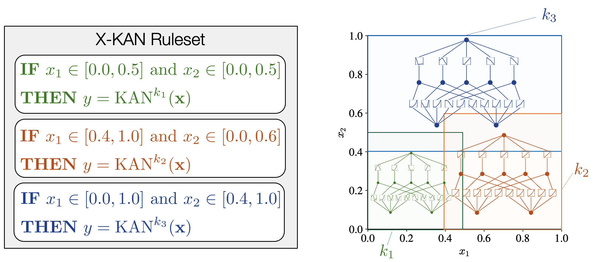
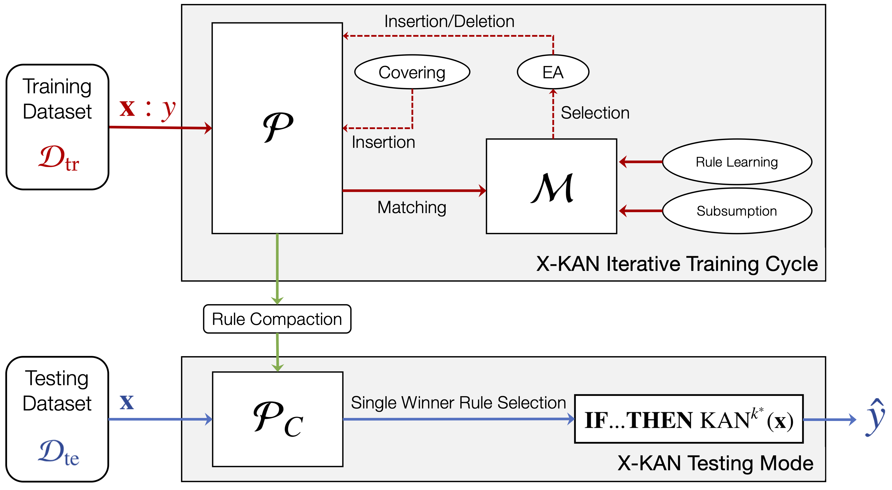

# X-KAN <!-- omit in toc -->
This repository contains the implementation for the IJCAI 2025 paper:

>Hiroki Shiraishi, Hisao Ishibuchi, and Masaya Nakata. 2025. **X-KAN: Optimizing Local Kolmogorov-Arnold Networks via Evolutionary Rule-Based Machine Learning**. In Proceedings of the 34th International Joint Conference on Artificial Intelligence (IJCAI '25). Accepted.

An extended version of this paper, including appendices, are available at: https://doi.org/10.48550/arXiv.2505.14273.

This repository provides the implementation of **X-KAN**, a novel function approximation method that integrates KAN (Kolmogorov-Arnold Networks) <sup><a id="ref1"></a>[[1]](#1)</sup> with an evolutionary rule-based machine learning algorithm called [XCSF](https://en.wikipedia.org/wiki/Learning_classifier_system) (X Classifier System for Function Approximation) <sup><a id="ref2"></a>[[2]](#2)</sup> <sup><a id="ref3"></a>[[3]](#3)</sup>. The evolutionary framework is written in Julia, with Python integration for the KAN models.

## What is X-KAN?



X-KAN is a function approximation method that combines KAN's high representational power with XCSF's adaptive partitioning capability. Unlike conventional neural networks that rely on a single global model, X-KAN represents the entire input space using multiple local KAN models, as shown above. Specifically:

* **Localized KAN Modeling**: Each rule in X-KAN consists of an antecedent defined as an n-dimensional hyperrectangle (IF part) and a consequent (THEN part) implemented as a single KAN model.

* **Dual Optimization Framework**: Utilizing the XCSF framework, X-KAN constructs general and accurate local KAN models through evolutionary optimization of rule antecedents and backpropagation-based consequent refinement.

* **Divide-and-Conquer Architecture**: Unlike global models, X-KAN integrates multiple specialized local KAN models through adaptive input space partitioning.
  
X-KAN has demonstrated superior performance compared to XCSF, Multi-Layer Perceptron (MLP) <sup><a id="ref4"></a>[[4]](#4)</sup>, and KAN across various benchmark problems, achieving significant reductions in approximation error while maintaining compact rulesets.

## Brief Algorithm of X-KAN


A schematic illustration of X-KAN is shown above. The run cycle depends on the type of run: training or testing. During the training mode, X-KAN searches for an accurate and maximally general ruleset, $\mathcal{P}$, using a training dataset, $\mathcal{D}_{\rm tr}$. After training is completed, rule compaction is applied to obtain a compact ruleset, $\mathcal{P}_C$. During the testing mode, X-KAN applies $\mathcal{P}_C$ to compute the predicted value, $\hat{y}$, for an unseen data point, $\mathbf{x}$, by using the single winner rule with the highest fitness.

### Training Mode <!-- omit in toc -->

1. **Match Set Formation**: For each training data point, X-KAN identifies the set of rules whose local region (antecedent) matches the input.
  
2. **Covering Operation**: If no existing rule matches the input, a new rule is created to cover that region.

3. **Rule Update**: The local KAN model in each matching rule is updated using backpropagation, and the rule’s fitness is updated using the Widrow-Hoff learning rule.

4. **Evolutionary Search**: Periodically, the algorithm selects parent rules based on fitness, applies crossover and mutation to create new rules, and integrates them into the population.

5. **Subsumption**: More general rules can absorb similar, more specific rules to keep the rule set compact.

6. **Rule Compaction**: After training, redundant rules are removed to produce a concise and efficient set of local models.

### Testing Mode <!-- omit in toc -->

1. **Match Set Formation**: For each test input, X-KAN finds the rules whose local region includes the input.

2. **Single Winner Selection**: The rule with the highest fitness is selected as the "winner."

3. **Prediction**: The winner’s KAN model is used to make the final prediction for the input.

## Setup and Usage Guide
### Requirements <!-- omit in toc -->
* Ubuntu 24.04.1 LTS or WSL2
* Julia v1.10.5 LTS or higher
* Python 3.9.7 or higher

### Installation <!-- omit in toc -->
Once Julia is installed, you can install the required Julia packages with the following command via the command line interface.
```bash
julia packages.jl
```

Once Python is installed, you can install the required Python packages with the following command via the command line interface.
```bash
pip install -r requirements.txt
```

### Usage <!-- omit in toc -->
You can train a X-KAN model using any tabular dataset (e.g., yourfile.csv) for regression via the command line interface. Note that:
* The rightmost column of the CSV file must represent the actual real value to be predicted, while all other columns should constitute the input features.
* Any missing values in the dataset should be represented by a question mark (?).
* Ensure that the CSV file does not contain a header row; the data should start from the first line.

Here are examples of how to run the models:


#### Run X-KAN <!-- omit in toc -->
```bash
julia ./main.jl --csv=yourfile.csv
```
#### Run X-KAN and KAN for Comparison <!-- omit in toc -->
```bash
julia ./main.jl --csv=yourfile.csv --compare_kan=true
```
#### For Further Details <!-- omit in toc -->
```bash
julia ./main.jl --help
```


### Reproducing Paper Results <!-- omit in toc -->
To reproduce the results from the paper:
#### Run X-KAN <!-- omit in toc -->
```bash
julia ./main.jl --all=true
```
#### Run X-KAN and KAN for Comparison <!-- omit in toc -->
```bash
julia ./main.jl --all=true --compare_kan=true
```

These codes will run experiments on the 8 datasets used in the main paper and output results.

### Output Examples <!-- omit in toc -->
Upon completion of the experiment, X-KAN generates the following files: 
- [`summary.csv `](#summarycsv)
- [`compacted_summary.csv`](#compacted_summarycsv)
- [`global_kan_summary.csv`](#global_kan_summarycsv)
- [`classifier.csv`](#classifiercsv)
- [`compacted_classifier.csv`](#compacted_classifiercsv)
- [`parameters.csv`](#parameterscsv-fuzzy-ucs)
- [`time.csv`](#timecsv)

#### `summary.csv` <!-- omit in toc -->
X-KAN tracks the following features every epoch:

* Iteration (`Iteration`): The number of training instances used up to the epoch
* Average Training Mean Absolute Error (`TrainErr`): MAE on the training dataset
* Average Testing Mean Absolute Error (`TestErr`): MAE on the testing dataset
* Average Population Size (`PopSize`): The number of rules in the population (ruleset)
* Occurrence Rate of the Covering Operation (`CovOccRate`)
* Number of the Subsumption Operation (`SubOccNum`)

These values are saved as `summary.csv`. An example of log output during the experiment is shown below.

```
      Epoch   Iteration    TrainErr     TestErr     PopSize  CovOccRate   SubOccNum
=========== =========== =========== =========== =========== =========== ===========
          1         900    0.166245    0.229590      19.000       0.006           1
          2        1800    0.166245    0.229590      23.000         0.0          14
          3        2700    0.149212    0.214724      18.000         0.0          22
          4        3600    0.109026    0.189545      21.000         0.0          32
          5        4500    0.091613    0.182431      23.000       0.001          31
          6        5400    0.082146    0.203242      30.000       0.001          21
          7        6300    0.094334    0.211943      22.000       0.003          22
          8        7200    0.080364    0.204120      21.000       0.001          23
          9        8100    0.090401    0.208691      21.000         0.0          36
         10        9000    0.093264    0.184493      18.000         0.0          34
```

#### `compacted_summary.csv` <!-- omit in toc -->
After applying the single winner-based rule compaction algorithm <sup><a id="ref5"></a>[[5]](#5)</sup> to the final ruleset $\mathcal{P}$, the performance metrics of the resulting ruleset $\mathcal{P}_C$ - including training MAE, testing MAE, and the number of rules - are saved as `compacted_summary.csv` .

```
 X-KAN after Rule Compaction:
Training Mean Absolute Error: 0.09326392201698498
 Testing Mean Absolute Error: 0.17995177819339678
      Compacted Ruleset Size: 12
```

#### `global_kan_summary.csv` <!-- omit in toc -->
For comparative analysis, when running X-KAN with the benchmarking flag `--compare_kan=true`, the system simultaneously executes both X-KAN and a conventional single global KAN model. The performance metric of the global KAN model - including training MAE and testing MAE - are saved as `global_kan_summary.csv`.

```
 A Single Global KAN Model:
Training Mean Absolute Error: 0.20299688265732746
 Testing Mean Absolute Error: 0.24679258616589186
```

#### `classifier.csv` <!-- omit in toc -->

An *n*-dimensional rule (a.k.a. classifier) *k* is represented as:

$$
\text{Rule } k: 
\textbf{ IF } x_{1}\in [l_{1}^{k}, u_{1}^{k}] \text{ and } \dots \text{ and } x_{n}\in [l_{n}^{k}, u_{n}^{k}] 
\textbf{ THEN } y = {\rm KAN}^k(\mathbf{x}) \textbf{ WITH } F^k,
$$

where:
- Rule-Antecedent (IF part) $\mathbf{A}^k=(\mathbf{l}^k,\mathbf{u}^k)=\bigl(l_{i}^{k}, u_{i}^{k}\bigr)_{i=1}^n$: 
  - Determines whether the rule matches a given input
  - $x_i$ is conditioned by $\bigl(l_{i}^{k}, u_{i}^{k}\bigr)$, which is represented by an interval with a lower bound $l_i^k$ and an upper bound $u_i^k$
- Rule-Consequent (THEN part) $y$: 
  - Indicates a local KAN model
- Rule-Fitness (WITH part) $F^k\in(0,1]$:
  - Denotes the quality reflecting accuracy $\kappa^k$ and generality ${\rm num}^k$

Each rule $k$ has the following book-keeping parameters:
- Error $\epsilon^k\in\mathbb{R}_0^+$:
  - Represents absolute approximation error of the consequent function approximation model
- Accuracy $\kappa^k\in(0,1]$:
  - Calculated based on the error
- Experience ${\rm exp}^k\in\mathbb{N}_0$:
  - Counts the number of times since its creation that the rule has belonged to a match set
- Time Stamp ${\rm ts}^k\in\mathbb{N}$:
  - Denotes the time-step of the last execution of the EA to create new rules, where the rule was considered as a candidate to be a parent
- Match Set Size ${\rm ms}^k\in\mathbb{R}^+$:
  - Averages the sizes of the match sets in which the rule has participated
- Generality (a.k.a. Numerosity) ${\rm num}^k\in\mathbb{N}_0$:
  - Indicates the number of rules that have been subsumed

The acquired X-KAN ruleset (i.e., $\mathcal{P}$ ) is saved as `classifier.csv` as shown below.

|ID|Antecedent|Consequent|Fitness|Error|Accuracy|Experience|Time Stamp|Match Set Size|Numerosity|
|:---:|:---:|:---:|:---:|:---:|:---:|:---:|:---:|:---:|:---:|
|98|[0.209:0.438, 0.0:0.915]|KAN|0.410814138|0.071178369|0.280984242|1514|8976|9.296128125|3|
|145|[0.0:0.255, 0.0:0.915]|KAN|0.733842598|0.148575569|0.134611633|1372|8959|9.208115507|7|
|181|[0.0:0.115, 0.0:0.287]|KAN|0.476522753|0.015659895|1|167|8748|8.880699421|1|
|275|[0.548:0.95, 0.915:0.995]|KAN|0.781893166|0.003271927|1|140|8992|6.978722149|5|
|352|[0.209:0.381, 0.0:0.915]|KAN|0.629774426|0.067386367|0.296795939|511|8976|10.80689915|6|
|401|[0.0:0.592, 0.915:0.998]|KAN|0.972902217|0.008250442|1|147|8872|9.76802591|6|
|446|[0.62:1.0, 0.0:0.818]|KAN|0.893397233|0.135653658|0.147434285|801|8969|4.545329739|4|
|476|[0.896:1.0, 0.563:1.0]|KAN|0.591219282|0.030992238|0.645322875|105|8992|8.398823403|3|
|595|[0.589:0.62, 0.0:0.818]|KAN|0.468114703|0.00256358|1|28|8965|7.348897755|3|
|623|[0.403:0.607, 0.0:0.915]|KAN|0.484197517|0.032312569|0.618954189|183|8965|7.110068367|3|
|657|[0.589:0.62, 0.0:0.873]|KAN|0.206033376|0.00256358|1|18|8965|7.348897755|1|
|718|[0.828:0.913, 0.563:1.0]|KAN|0.408082902|0.007539413|1|10|8969|8.189997977|1|
|722|[0.403:0.62, 0.0:0.818]|KAN|0.28634317|0.034280678|0.583419026|50|8965|7.123276783|2|
|735|[0.796:1.0, 0.563:1.0]|KAN|0.075661865|0.108398092|0.184505092|11|8992|8.034556613|1|
|748|[0.403:0.607, 0.0:1.0]|KAN|0.080864096|0.058110521|0.344171757|11|8965|7.110068367|1|
|752|[0.403:0.62, 0.0:0.915]|KAN|0.098179685|0.035562109|0.562396344|4|8965|7.178635651|1|
|753|[0.913:1.0, 0.0:0.818]|KAN|0.12839579|0.10062216|0.198763374|2|8969|7.041598705|1|
|754|[0.62:0.828, 0.513:1.0]|KAN|0.143667379|0.068123007|0.29358657|3|8969|5.446660514|1|


#### `compacted_classifier.csv` <!-- omit in toc -->
The compacted X-KAN ruleset $\mathcal{P}_C$ is saved as `compacted_classifier.csv` as shown below.

|ID|Antecedent|Consequent|Fitness|Error|Accuracy|Experience|Time Stamp|Match Set Size|Numerosity|
|:---:|:---:|:---:|:---:|:---:|:---:|:---:|:---:|:---:|:---:|
|145|[0.0:0.255, 0.0:0.915]|KAN|0.733842598|0.148575569|0.134611633|1372|8959|9.208115507|7|
|748|[0.403:0.607, 0.0:1.0]|KAN|0.080864096|0.058110521|0.344171757|11|8965|7.110068367|1|
|476|[0.896:1.0, 0.563:1.0]|KAN|0.591219282|0.030992238|0.645322875|105|8992|8.398823403|3|
|401|[0.0:0.592, 0.915:0.998]|KAN|0.972902217|0.008250442|1|147|8872|9.76802591|6|
|623|[0.403:0.607, 0.0:0.915]|KAN|0.484197517|0.032312569|0.618954189|183|8965|7.110068367|3|
|275|[0.548:0.95, 0.915:0.995]|KAN|0.781893166|0.003271927|1|140|8992|6.978722149|5|
|718|[0.828:0.913, 0.563:1.0]|KAN|0.408082902|0.007539413|1|10|8969|8.189997977|1|
|446|[0.62:1.0, 0.0:0.818]|KAN|0.893397233|0.135653658|0.147434285|801|8969|4.545329739|4|
|754|[0.62:0.828, 0.513:1.0]|KAN|0.143667379|0.068123007|0.29358657|3|8969|5.446660514|1|
|98|[0.209:0.438, 0.0:0.915]|KAN|0.410814138|0.071178369|0.280984242|1514|8976|9.296128125|3|
|352|[0.209:0.381, 0.0:0.915]|KAN|0.629774426|0.067386367|0.296795939|511|8976|10.80689915|6|
|595|[0.589:0.62, 0.0:0.818]|KAN|0.468114703|0.00256358|1|28|8965|7.348897755|3|


#### `parameters.csv` <!-- omit in toc -->
X-KAN has the following hyperparameters <sup><a id="ref6"></a>[[6]](#6)</sup>:
- $N$ (`N`): Maximum size of the ruleset
- $\beta$ (`beta`): Learning rate for $F^k$ and ${\rm ms}^k$
- $\epsilon_0$ (`e0`): Target error, under which $\kappa^k$ is set to 1
- $\theta_{\rm EA}$ (`theta_EA`): EA invocation frequency. The EA is applied in a match set when the average time since the last EA in the match set is grater than $\theta_{\rm EA}$ 
- $\chi$ (`chi`): Probability of applying crossover in the EA
- $\mu$ (`mu`): Probability of mutating an allele in the offspring
- $m_0$ (`m0`): Maximum change amount in mutation
- $\theta_{\rm del}$ (`theta_del`): The deletion threshold. If ${\rm exp}^k$ is greater than $\theta_{\rm del}$, $F^k$ may be considered in its probability of deletion
- $\delta$ (`delta`): Fraction of the mean fitness in the ruleset below which the fitness of a rule may be considered in its probability of deletion
- $P_\\#$ (`P_hash`): Probability of using $[0,1]$ in one attribute in $\mathbf{A}^k$ when covering
- $r_0$ (`r0`): Maximum range in covering
- $F_I$ (`F_I`): Rule initial fitness
- $\tau$ (`tau`): Tournament size in parent selection
- $doSubsumption$ (`doSubsumption`): Whether subsumption is performed


The used hyperparameter values are saved as `parameters.csv` as shown below.
|Parameter|Value|
|:----|:---:|
|N|50|
|beta|0.2|
|e0|0.02|
|theta_EA|100|
|chi|0.8|
|mu|0.04|
|m0|0.1|
|theta_del|100|
|delta|0.1|
|P_hash|0.8|
|r0|1.0|
|F_I|0.01|
|tau|0.4|
|doSubsumption|TRUE|


#### `time.csv` <!-- omit in toc -->
The runtime (sec.) is saved as `time.csv` as shown below.
```
44.36
```

## Acknowledgement
We use the implementation of KAN from [pykan repository](https://github.com/KindXiaoming/pykan) as a rule consequent in X-KAN.

## Copyright

The copyright of this X-KAN repository belongs to the authors in the [Evolutionary Intelligence Research Group](http://www.nkt.ynu.ac.jp/en/) (Nakata Lab) at Yokohama National University, Japan. You are free to use this code for research purposes. In such cases, we kindly request that you cite the following paper:

>Hiroki Shiraishi, Hisao Ishibuchi, and Masaya Nakata. 2025. **X-KAN: Optimizing Local Kolmogorov-Arnold Networks via Evolutionary Rule-Based Machine Learning**. In Proceedings of the 34th International Joint Conference on Artificial Intelligence (IJCAI '25). Accepted.

```bibtex
@inproceedings{shiraishi2025xkan,
author = {Shiraishi, Hiroki and Ishibuchi, Hisao and Nakata, Masaya},
title = {X-KAN: Optimizing Local Kolmogorov-Arnold Networks via Evolutionary Rule-Based Machine Learning},
year = {2025},
booktitle = {Proceedings of the Thirty-Fourth International Joint Conference on Artificial Intelligence},
location = {Montreal, Canada},
series = {IJCAI '25}
}
```

## References
<a id="1"></a>
[1] Liu, Ziming, et al. "**KAN: Kolmogorov-arnold networks**." arXiv preprint arXiv:2404.19756 (2024). https://doi.org/10.48550/arXiv.2404.19756 [[↑]](#ref1)   

<a id="2"></a>
[2] Wilson, Stewart W. "**Classifiers that approximate functions**." Natural Computing 1.2 (2002): 211-234. https://doi.org/10.1023/A:1016535925043 [[↑]](#ref2)  

<a id="3"></a>
[3] Preen, Richard J., Stewart W. Wilson, and Larry Bull. "**Autoencoding with a classifier system**." IEEE Transactions on Evolutionary Computation 25.6 (2021): 1079-1090. https://doi.org/10.1109/TEVC.2021.3079320 [[↑]](#ref3) 

<a id="4"></a>
[4] Cybenko, George. "**Approximation by superpositions of a sigmoidal function**." Mathematics of control, signals and systems 2.4 (1989): 303-314.  https://doi.org/10.1007/BF02551274 [[↑]](#ref4)  

<a id="5"></a>
[5] Orriols-Puig, Albert, Jorge Casillas, and Ester Bernadó-Mansilla. "**Fuzzy-UCS: a Michigan-style learning fuzzy-classifier system for supervised learning**." IEEE Transactions on Evolutionary Computation 13.2 (2008): 260-283. https://doi.org/10.1109/TEVC.2008.925144 [[↑]](#ref5)  

<a id="6"></a>
[6] Butz, Martin V., and Stewart W. Wilson. "**An algorithmic description of XCS**." Soft Computing 6 (2002): 144-153. https://doi.org/10.1007/s005000100111 [[↑]](#ref6)